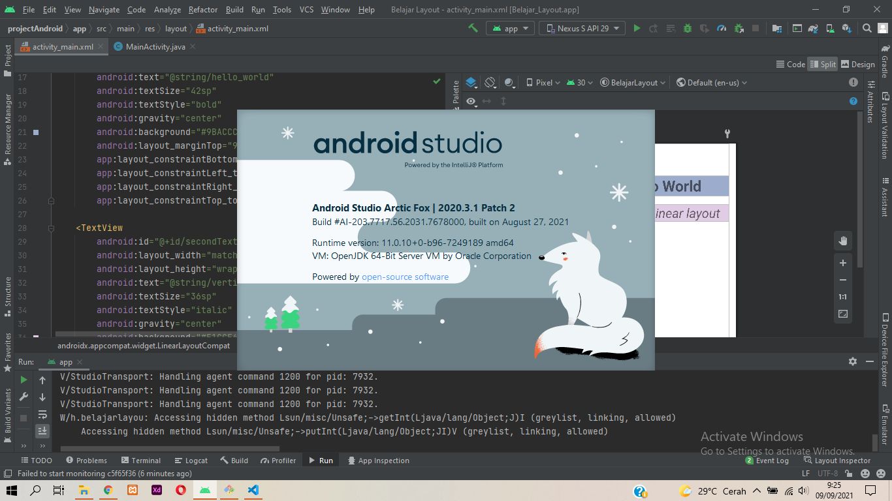
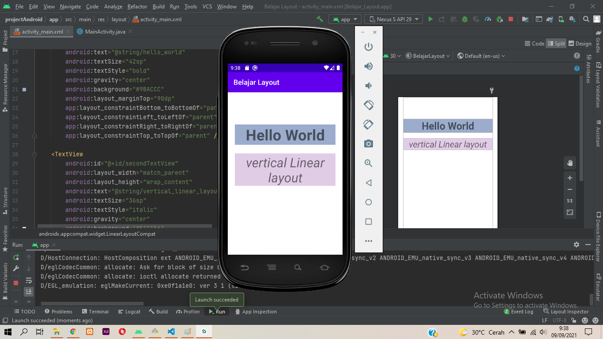

# 01 - Setup Android

## Tujuan Pembelajaran

1. Setup dan instalasi android studio

## Hasil Praktikum

Berikut ini adalah bukti telah berhasil setup android studio, saat ini yang terpasang merupakan versi arctic fox 2020.3.1

pada praktikum ini, emulator telah terinstall dan dapat dijalankan

<!-- [contoh link](../../src/01_pengantar/hello.js) -->