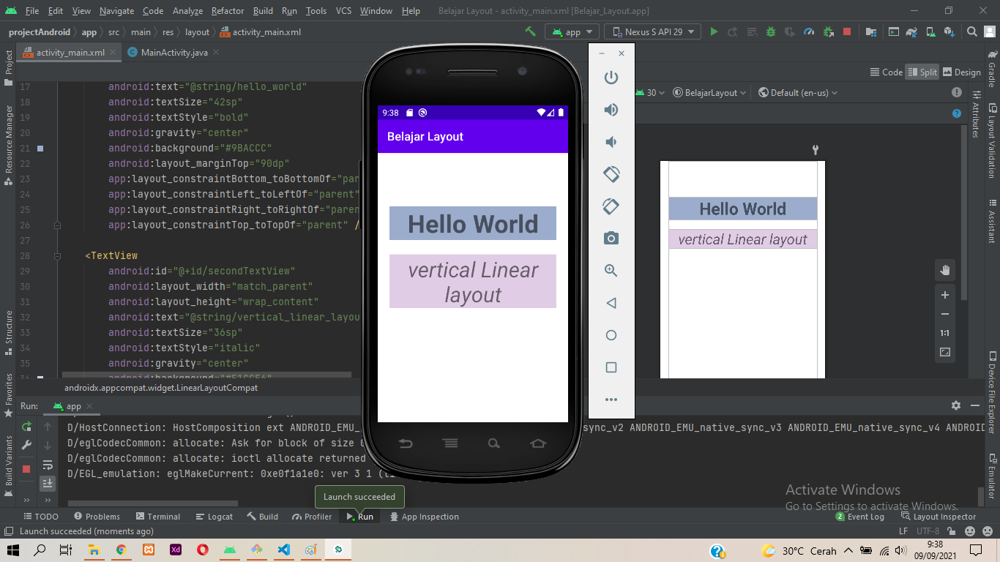
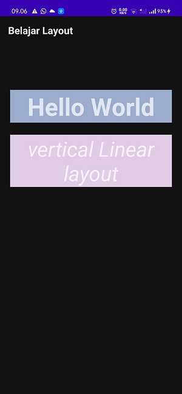

# 02 - Layout dan Activity

## Tujuan Pembelajaran

1. Memahami konsep layout dan activity
2. Dapat membuat Layout pada Android Studio
3. Menjalankan aplikasi pada HP sebagai device fisik
4. Membuat halaman login sederhana menggunakan Linear Layout

## Hasil Praktikum
Berikut adalah bukti hasil praktikum:
### 1. Linier Layout
hasil debugging dengan emulator

hasil debugging dengan HP sebagai device fisik

[source code](../../src/02_layout_activity/Linear_layout)

### 2. 

